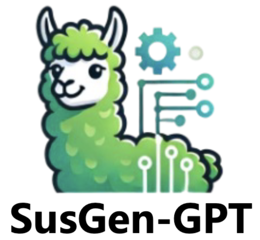
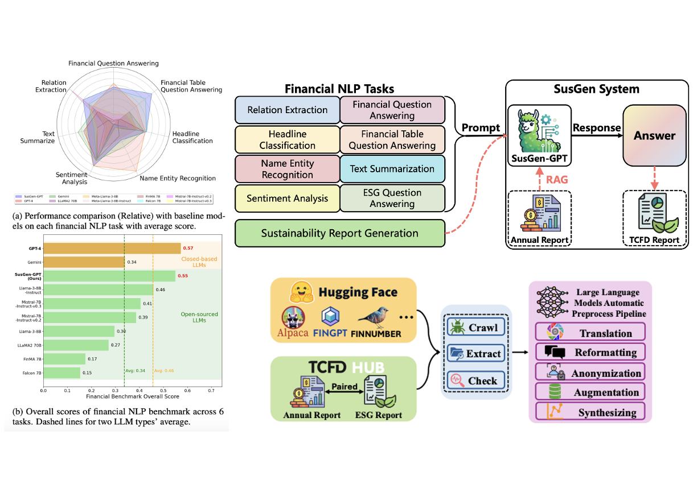

<p>
  <h1>
    
    SusGen-GPT: A Data-Centric LLM for Financial NLP and Sustainability Report Generation (NAACL Findings 2025)
  </h1>
</p>

<!-- <div align="center"> -->
[](https://arxiv.org/abs/2412.10906)&nbsp;
[](https://huggingface.co/WHATX)&nbsp;
[](https://wandb.ai/whatx)&nbsp;
[](https://jerrywu-code.github.io/files/susgen_demo.mp4)
<!-- </div> -->
<!--  -->

This is the official repository for *[SusGen-GPT: A Data-Centric LLM for Financial NLP and Sustainability
Report Generation](https://arxiv.org/pdf/2412.10906)*.

<p align="center">
  
</p>

## 🌿 Introduction
We present **SusGen-30K**, a meticulously curated instruction-tuning dataset for financial and ESG NLP domain; Then, we introduce **SusGen-GPT**, a suite of fine-tuned LLMs that achieve state-of-the-art performance across financial and ESG benchmarks with only 7–8B parameters; Besides, we propose **TCFD-Bench**, a benchmark designed to evaluate sustainability report generation, setting a new standard for model evaluation in this domain.


<details>
<summary><strong>Tasks Supported</strong> (Click to expand)</summary>

>Headline Classification (**HC**), Named Entity Recognition (**NER**), Relation Extraction (**RE**), Sentiment Analysis (**SA**), Financial Question Answering (**FIN-QA**), Financial Tabel Question Answering (**FIN-TQA**), Text Summarisation (**SUM**), Sustainability Report Generation (**SRG**).

</details>

## 📰 News

**2025.1.23**:  🎉🎉🎉 **Our paper is accepted to [**NAACL**](https://2025.naacl.org/) Findings 2025!** 🎉🎉🎉

**2025.1.12**:  Code and checkpoints are released.

**2024.12.14**:  🍃🍃🍃 SusGen is released! 🍃🍃🍃  See our [](https://arxiv.org/abs/2412.10906) and [](https://huggingface.co/WHATX).

## Getting Started

### 1. Set Up the Environment

```shell
git clone git@github.com:JerryWu-code/SusGen.git
cd SusGen/
conda create --name susgen python==3.10 -y
conda activate susgen
export VLLM_INSTALL_PUNICA_KERNELS=1
pip install -r requirements.txt
```

### 2. Download the model checkpoint
Before you downloaded the checkpoint, make sure you have access to [Llama3-8B-Instruct](https://huggingface.co/meta-llama/Meta-Llama-3-8B-Instruct), [Llama3-8B](https://huggingface.co/meta-llama/Meta-Llama-3-8B), [Mistral-7B-Instruct-v0.3](https://huggingface.co/mistralai/Mistral-7B-Instruct-v0.3) and [Mistral-7B-v0.3](https://huggingface.co/mistralai/Mistral-7B-v0.3)
 and our lora [checkpoint](https://huggingface.co/WHATX/). And login in your huggingface client in the terminal.
```shell
# 1. set up the huggingface client
huggingface-cli login # prompt in your write permit access token
mkdir ckpts && cd ckpts/
git lfs install
# 2. download the llm base checkpoint
git clone https://huggingface.co/meta-llama/Meta-Llama-3-8B-Instruct
git clone https://huggingface.co/meta-llama/Meta-Llama-3-8B
git clone https://huggingface.co/mistralai/Mistral-7B-Instruct-v0.3
git clone https://huggingface.co/mistralai/Mistral-7B-v0.3
# 3. download the lora checkpoint (replace the 'path-to-our-lora-checkpoint' with the actual path)
git clone https://huggingface.co/WHATX/path-to-our-lora-checkpoint
```
<!-- ### Run the demo

```shell
cd src/
CUDA_VISIBLE_DEVICES=0 python demo.py --base_model Mistral-7B-Instruct-v0.3 --lora_path ../ckpts/path-to-our-lora-checkpoint-dir
``` -->

### 3. Data Preparation

You could download:
1) Only the data **SusGen-30k** in our huggingface repository via this [link](https://huggingface.co/datasets/WHATX/SusGen-30k), and put it under the folder [data/SusGen/](./data/SusGen/).
2) Data along with preprocessing parts and additional data via this [link](https://huggingface.co/datasets/WHATX/SusGen). And put it under the folder [data/](./data/).

### 4. Training
Adjust configs in the `configs/training_configs/finetune_config.yaml` and then run the following command:
```python
cd src/
CUDA_VISIBLE_DEVICES=0 /home/(you hostname)/anaconda3/envs/susgen/bin/torchrun --nproc_per_node=1 --master_port=29501 finetune.py --config configs/training_configs/finetune_config.yaml
```

<!-- ### 5. Evaluation
```python
cd eval/code/
CUDA_VISIBLE_DEVICES=0 python eval.py
``` -->

## 📑 Open-source Plan

- [X] Release the curated training data SusGen-30k.
- [X] Release the curated evaluation data TCFD-Bench.
- [X] Release the training & inference code.
- [X] Release the data preprocessing code.
- [X] Release the suite of trained model checkpoints SusGen-GPT.
- [X] Release the evaluation code.
- [ ] Release more if have time ...
## 🤝 About Team

<p align="center">
  
</p>

<table id="Team" style="margin: 0 auto; width:100%;">
  <tr>
    <th>Project Leader</th>
    <th>Project Members</th>
    <th>Other Members</th>
    <th>PI</th>
  </tr>
  <tr>
    <td>
      <a href="https://jerrywu-code.github.io/">Qilong Wu</a></td>
    <td>
      <a href="https://www.linkedin.com/in/xiaoneng-hsiang/">Xiaoneng Xiang</a><br>
      <a href="https://www.linkedin.com/in/hejia-huang-336268288/">Hejia Huang</a><br>
      <a href="https://www.linkedin.com/in/xuanw2060/">Xuan Wang</a><br>
    </td>
    <td>
      <a href="https://www.linkedin.com/in/yeoweijie210/">Yeo Wei Jie</a><br>
      <a href="https://www.linkedin.com/in/shirota/">Ricardo Shirota Filho</a><br>
    </td>
    <td>
      <a href="https://www.linkedin.com/in/ranjansatapathy/">Dr. Satapathy Ranjan</a> (A*STAR)<br>
      <a href="https://scholar.google.com/citations?user=IqAJttsAAAAJ&hl=en">Prof. Bharadwaj Veeravalli </a> (NUS)
    </td>
  </tr>
</table>

## 📄 Citation

If our work assists your research or you use our data, feel free to give us a star ⭐ or cite us using

```
@article{wu2024susgen,
  title={SusGen-GPT: A Data-Centric LLM for Financial NLP and Sustainability Report Generation},
  author={Wu, Qilong and Xiang, Xiaoneng and Huang, Hejia and Wang, Xuan and Jie, Yeo Wei and Satapathy, Ranjan and Veeravalli, Bharadwaj and others},
  journal={arXiv preprint arXiv:2412.10906},
  year={2024}
}
```

## 🍎 Acknowledgement
We thank the great work from [QLoRA](https://arxiv.org/abs/2305.14314), [FinGPT](https://github.com/AI4Finance-Foundation/FinGPT) and [PIXIU](https://github.com/The-FinAI/PIXIU), and thank to the paper inspiration from [ChatReport](https://github.com/EdisonNi-hku/chatreport) and [Common-7B](https://arxiv.org/abs/2403.04706). This project was sponsored by National University of Singapore and A*STAR Institute of High Performance.
